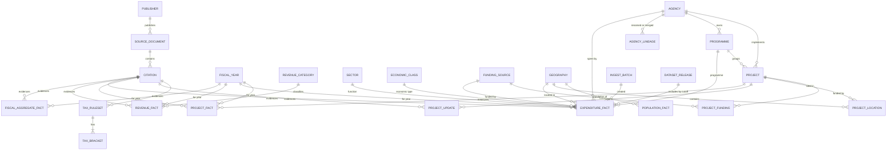

# Bhutan Public Finance Tracker — Architecture & Data Design

Oct 5, 2026 · @K.T

## 1. Loopholes in the current spec

The spec's principles are strong; the weak spots are in the data model, which treats a budget number as one value with one source. In public finance, the same line is published three or four times (estimate, revised, actual, audited) across different documents. The five critical items below would each force a schema rewrite if found after week 2.

| # | Loophole | Why it bites | Fix (section) | Severity |
| --- | --- | --- | --- | --- |
| 1 | Project-level actual expenditure may not be published | The flagship Project Tracker is rated "High" feasibility, but it depends on per-project actuals that may only exist at agency or programme level | 3-day data-availability spike before any code; go/no-go gate; fall back to programme-level execution (8) | Critical |
| 2 | `project_financials` has one `source_id` for three numbers | Original allocation, revised allocation and actual come from different reports published up to two years apart, so two of the three are effectively unsourced | One fact row per measure, each with its own citation (5) | Critical |
| 3 | No stage / vintage dimension | A year's revenue appears as budget estimate, then revised estimate, then actual. Without a `stage` column, the newest import overwrites the old, or charts mix estimates with actuals | `stage` on every fact + a best-value view (4, 5) | Critical |
| 4 | Conflict display is undefined | "Store both and flag" doesn't say which number the dashboard shows, so the choice ends up in whichever query runs first | Deterministic precedence: review state → stage → source rank → publication date (4) | Critical |
| 5 | Sector → Agency → Programme → Project is modelled as a tree | Agencies span sectors; Dzongkhags and Thromdes deliver projects for many sectors. Administrative, functional and economic classification are three independent axes | Separate dimensions; facts reference each one (5) | Critical |
| 6 | Agencies change over time | Ministries were merged and renamed in the 2022–23 civil service reform, so multi-year agency comparisons break silently | Stable `agency_key` + lineage table (merged\_into, renamed\_to) (5) | High |
| 7 | `sources` stores `page_number` | One document becomes many "sources" (one per page), and de-duplication breaks | Split `source_document` (the PDF) from `citation` (page, table, snippet) (5) | High |
| 8 | Evidence can disappear | Government sites reorganise and PDFs move; the spec keeps raw files out of Git but doesn't say where they go | Object storage keyed by SHA-256 + Wayback Machine snapshot on ingest (3, 7) | High |
| 9 | "Store currency and scale separately" | Summing Nu. million rows with Nu. billion rows is the classic bug; every query must remember to multiply | Canonical `amount_nu NUMERIC(18,2)` plus `reported_value` / `reported_unit` for audit (5) | High |
| 10 | Fiscal year vs calendar year in per-capita metrics | Bhutan's FY runs 1 July–30 June; NSB population figures are calendar-year | Mapping rule stored in the metric definition and shown in methodology (5, 7) | High |
| 11 | Nominal-only history | "Education budget up 40% in five years" ignores inflation and economic growth | Add CPI and GDP facts; show real terms and % of GDP beside nominal (5) | High |
| 12 | Double counting | Summing project allocations into agency totals undercounts; central grants to local governments get counted at both levels | Never derive totals from children; store published totals and show coverage % (4) | High |
| 13 | One reviewer = no maker-checker | "Human review" is you alone; a typo becomes official-looking data | Control-total reconciliation, mandatory evidence snippet, monthly re-verification sample (7) | High |
| 14 | No funding source | Externally financed projects (donor grants, loans) get attributed to domestic revenue | `funding_source` dimension on projects and expenditure (5) | High |
| 15 | `location` is a free-text string | Highways and transmission lines cross several Dzongkhags; romanisation varies (Trashigang / Tashigang) | Geography table + project\_location many-to-many + aliases + trigram search (5) | High |
| 16 | Execution-rate denominator is ambiguous | Multi-year projects mix annual allocation with total cost; supplementary budgets push rates past 100% | Execution = actual(FY) ÷ revised(FY), same FY only; total cost is a separate measure (5) | High |
| 17 | Tax estimator scope | Deductions, multiple income types and indirect-tax incidence are hard; the consumption-tax regime may differ by FY | MVP = personal income tax on salary only; indirect tax in phase 2 (6) | Medium |
| 18 | `tax_rules.parameters` is an untyped blob | JSON brackets can't be validated by the database or tested row by row | Structured `tax_ruleset` + `tax_bracket` rows (5) | Medium |
| 19 | Client-only React SPA | Public pages aren't indexable or shareable with previews, the main way civic data spreads | Server-render or pre-render public pages (3) | Medium |
| 20 | Roadmap order | Schema is frozen in week 2, but ingestion reality arrives in week 7 | Data spike first, then vertical slices (8) | Medium |
| 21 | No published-data versioning | A half-finished review changes live numbers; there's no "data as of" | `dataset_release` snapshots; the site serves one release at a time (4, 5) | Medium |
| 22 | Django admin exposed | The verification UI is also a write path to "official-looking" data | Separate admin host, 2FA, no public write endpoints (7) | Medium |
| 23 | News content reuse | Storing full articles raises copyright issues | Store metadata, a short quote and the link only (7) | Medium |
| 24 | Your own position | If you enter the civil service, rules on outside work and public commentary may apply to a site about government spending | Check the civil service rules before launch; keep the neutral, source-only tone (7) | Medium |

## 2. Revised scope and design principles

The MVP stays as specified, with one change: project-level tracking becomes "as deep as the data allows" instead of a fixed field list. The data is small (thousands of rows, tens of thousands at most), so the right architecture is one PostgreSQL database and a disciplined pipeline. Kafka, Spark, Airflow or a warehouse would add operational cost with no benefit.

**MVP scope (revised)**

| Area | MVP | Deferred |
| --- | --- | --- |
| Revenue | 3 FYs, by category, every available stage (estimate, revised, actual) | Monthly / quarterly data |
| Expenditure | 3 FYs, by agency, sector and current vs capital | Programme-level detail where it isn't published |
| Projects | 15–30 hand-verified projects, showing whichever measures exist | National coverage, map |
| Metrics | Per resident, % of GDP, real terms, execution rate | Custom user-built metrics |
| Tax estimator | Personal income tax on salary, versioned rules | Indirect tax, business income, deductions beyond the basics |
| Ingestion | Manual entry through admin + CSV import with validation | PDF extraction, news monitoring |

**Principles every contributor (and every AI prompt) follows**

1. **A fact is immutable.** A correction creates a new row that supersedes the old one; nothing is updated in place.
2. **A fact is four things:** a value, a stage (estimate, revised, actual, audited), a citation (document + page) and a review state.
3. **Totals are stored, never derived.** A published agency total is a fact; the sum of tracked projects is a coverage metric.
4. **Calculated metrics are computed at read time** from versioned definitions, so every derived number can show its formula and inputs.
5. **The public site serves one dataset release at a time.** Review work never leaks into live numbers.
6. **Boring technology wins.** Postgres features (constraints, views, full-text search) before new services.

## 3. System architecture

Three deployables and one database: a Django back office (admin, pipeline, API), a server-rendered Next.js public site, and PostgreSQL, with source PDFs in object storage. Keep Django from the spec: its admin is a free, secure verification UI, which is the most valuable screen in this project. Change the frontend from a client-only React SPA to Next.js (still React + TypeScript), so every project and agency page is indexable and shares with a preview card.

&#91;embedded content: System architecture · 9 components\]

Writes enter only through the pipeline and the admin; readers reach data only through a read-only API pinned to a published release.

**Components**

| Component | Technology | Responsibility | Notes |
| --- | --- | --- | --- |
| Public site | Next.js (App Router), TypeScript strict, Tailwind, Recharts | Dashboards, project pages, sources, methodology, estimator UI | Static generation, re-built when a dataset release is published |
| API | Django 5 + Django REST Framework, drf-spectacular | Read-only public API, estimator endpoint | OpenAPI schema generates the frontend's TypeScript types |
| Back office | Django admin (+ django-otp for 2FA) | Data entry, review queue, conflicts, releases | Separate hostname, never linked from the public site |
| Pipeline | Python package run as Django management commands | Fetch, extract, normalise, validate, stage candidates | pdfplumber / camelot for tables; no orchestrator needed |
| Database | PostgreSQL 16 with `pg_trgm`, `unaccent` | Canonical facts, evidence, audit history | PostGIS added only when the map ships |
| Evidence store | S3-compatible object storage (e.g. Cloudflare R2) | Original PDFs and page screenshots, keyed by SHA-256 | Immutable bucket; Wayback snapshot requested on ingest |
| Scheduler | GitHub Actions cron (phase 2) | Watch source pages for new PDFs, open an issue | Replaces Airflow at this scale |
| Monitoring | Sentry + uptime check | Errors, broken source links | Free tiers suffice |

**Key decisions**

- **Types flow one way:** Django models → DRF serializers → OpenAPI → `openapi-typescript` → frontend types. Cursor never hand-writes API types, so the frontend can't drift from the backend.
- **The public API is read-only and cacheable.** Every response carries the release version; the CDN caches by it, and publishing a release triggers a site rebuild.
- **The estimator is stateless.** Inputs are never logged or stored; the rules are fetched from the database by effective date.
- **Environments:** `docker compose` locally (postgres, api, web); production on any simple host (one Django service, managed Postgres, Next.js on a static/edge host). Pick one host and don't optimise further until real traffic exists.

## 4. Data flow

Every number travels the same path: a document is captured once, values become candidates with a page citation, automated checks run, you approve, and only a published release reaches the public. Nothing skips the candidate stage, including values you type by hand.

&#91;embedded content: Data flow · 10 stages, 2 return loops\]

Rejected candidates and reader corrections both re-enter at extraction, so every fix leaves the same audit trail as the original value.

**Stages**

| # | Stage | Input → output | Where it runs | Automated checks |
| --- | --- | --- | --- | --- |
| 1 | Discover | Source register entry → URL to fetch | Manual; GitHub Actions watcher in phase 2 | New-PDF detection on watched pages |
| 2 | Acquire | URL → `source_document` + file in object storage | `manage.py acquire <url>` | SHA-256 de-duplication; MIME and size check; Wayback snapshot request |
| 3 | Extract | Document → `candidate_fact` rows (raw text value, page, snippet) | Admin form, CSV template, or PDF table extractor | Required citation (document + page); raw value kept verbatim |
| 4 | Normalise | Raw text → typed values | `pipeline.normalise` | "Nu. 1,234.5 million" → 1234500000.00; FY label → `fiscal_year_id`; names → entity via alias tables, unknowns queued |
| 5 | Validate | Candidate → candidate + `data_quality_flag` rows | `pipeline.validate` | Control totals within rounding tolerance; sign and range; year-on-year jump > 50%; duplicates; conflict with verified facts |
| 6 | Review | Candidate → verified fact, or rejected | Django admin review screen | Blocked while a critical flag is open; reviewer and timestamp recorded |
| 7 | Resolve | Verified facts → one display value per key and stage | SQL views (`v_*_best`) | Precedence rule below |
| 8 | Release | Verified set → `dataset_release` | `manage.py publish_release` | No open critical flags; all control totals pass; CSV/JSON snapshot + checksum exported |
| 9 | Serve | Release → API → pre-rendered pages | DRF + Next.js rebuild via webhook | Release version in every response |
| 10 | Feedback | Reader report → flag or GitHub issue | "Report a problem" link on every number | Links back to the exact fact id |

**Precedence rule (which number is shown)**

A dashboard always asks for a specific stage ("Budget estimate FY 2026–27" or "Actual FY 2024–25"), so stages never compete. Within one key and one stage:

1. Only `verified`, non-superseded facts are eligible.
2. Higher source rank wins (official document > official webpage > NSB > Parliament > news).
3. Among equal ranks, the later publication date wins (a corrigendum beats the original).
4. Remaining ties raise a conflict flag and block the release until you resolve it.

A "headline" figure for a year uses the most mature stage available (audited > actual > revised > estimate) and always displays which stage it is.

**Calculated metrics**

Metrics such as per-resident spending, % of GDP and execution rate are never stored as facts. A `metric_definition` row holds the code, version, formula and input rules (for example, which population year maps to a fiscal year). The API computes the value at read time and returns the formula version and the ids of every input fact, so the UI can show "Calculated from …" with links.

## 5. Database design

The model is a small star schema with an evidence spine: reference dimensions around a few fact tables, and every fact pointing to a citation (a page in a stored document). Facts are append-only; corrections supersede, and a timestamp on supersession lets any past release be reproduced exactly.

### 5.1 Conventions

- **Keys:** `bigint` identity primary keys internally; public URLs use stable `key` slugs, never ids.
- **Money:** `amount_nu NUMERIC(18,2)` in whole ngultrum. Never floats, never millions. The figure as printed is kept in `reported_value` and `reported_unit`.
- **Fiscal year:** `fiscal_year.id` is the start year (2026 = FY 2026–27, 1 July 2026–30 June 2027), enforced by a check constraint.
- **Stage codes:** `BE` budget estimate, `RE` revised estimate, `PA` provisional actual, `AA` audited actual.
- **NULL dimension = total across that dimension**, not "unknown". An `expenditure_fact` with an agency and every other dimension NULL is that agency's total.
- **Enums:** Django `TextChoices` backed by `CHECK` constraints, so bad values fail in the database too.
- **Time:** `timestamptz` stored in UTC, displayed in Asia/Thimphu.
- **No deletes:** a fact is superseded (replaced) or withdrawn (`superseded_at` set with no replacement).

### 5.2 Shared fact columns

Every fact table (`fiscal_aggregate_fact`, `revenue_fact`, `expenditure_fact`, `project_fact`, `population_fact`, `macro_fact`) inherits one abstract Django model with these columns (statistics tables store \`value\` + \`unit\` instead of \`amount\_nu\`, and \`series\` + \`vintage\` instead of \`stage\`):

| Column | Type | Rule |
| --- | --- | --- |
| `stage` | text | BE / RE / PA / AA (statistics tables use `series` instead) |
| `amount_nu` | numeric(18,2) | Canonical value |
| `reported_value`, `reported_unit` | text | Verbatim from the source, for audit |
| `provenance` | text | OFFICIAL / REPORTED / ESTIMATE (CALCULATED is never stored) |
| `citation_id` | FK, NOT NULL | No citation, no row |
| `review_state` | text | CANDIDATE / VERIFIED / REJECTED |
| `reviewed_by_id`, `reviewed_at` | FK, timestamptz | Required unless CANDIDATE |
| `superseded_by_id`, `superseded_at` | FK, timestamptz | Set when replaced or withdrawn |
| `ingest_batch_id` | FK | Which import created it |
| `notes` | text | Reviewer notes |

The spec's six status labels map onto three columns: OFFICIAL and REPORTED → `provenance`; UNVERIFIED → `review_state = CANDIDATE`; SUPERSEDED → `superseded_at`; ESTIMATE → `provenance`; CALCULATED → computed at read time, never stored.

### 5.3 Table catalogue

| Group | Table | One row is… | Key columns |
| --- | --- | --- | --- |
| Reference | `fiscal_year` | One Bhutan fiscal year | `id` (start year), `label` |
| Reference | `geography` | A Dzongkhag, Thromde or Gewog | `level`, `code`, `parent_id` |
| Reference | `agency` | One agency over its lifetime | `key`, `kind`, `parent_id`, `valid_from`, `valid_to` |
| Reference | `agency_lineage` | One rename, merger or split | `relation`, `effective_date`, `citation_id` |
| Reference | `sector` | A functional category | `key`, `cofog_code` |
| Reference | `programme` | A programme within a plan period | `agency_id`, `sector_id`, `plan_period` |
| Reference | `economic_class` | Current / capital and object codes (tree) | `code`, `parent_id` |
| Reference | `revenue_category` | Tax, non-tax and grant categories (tree) | `code`, `kind`, `parent_id` |
| Reference | `funding_source` | Government funds or an external partner | `kind` (domestic, grant, loan) |
| Reference | `agency_alias`, `project_alias`, `geography_alias` | An alternative spelling | `alias` (trigram-indexed) |
| Evidence | `publisher` | An organisation that publishes sources | `kind`, `rank` (spec's hierarchy, 1 = highest) |
| Evidence | `source_document` | One captured file or page | `sha256` (unique), `storage_key`, `archive_url`, `publication_date` |
| Evidence | `citation` | One location inside a document | `document_id`, `page`, `locator`, `snippet` |
| Facts | `fiscal_aggregate_fact` | A headline total for one FY and stage | `measure` (total resources, total expenditure, fiscal balance…); doubles as control totals |
| Facts | `revenue_fact` | One revenue category × FY × stage × citation | `revenue_category_id` |
| Facts | `expenditure_fact` | One dimension combination × FY × stage × citation | agency, sector, programme, economic class, funding source, geography |
| Projects | `project` | A project's identity only | `key`, `name`, `code`, `agency_id`, `sector_id`, `programme_id` |
| Projects | `project_location`, `project_funding` | A project's place or funder (many-to-many) | `geography_id`, `funding_source_id` |
| Projects | `project_fact` | One measure × project × FY × stage | `measure`: original / revised allocation, actual expenditure, total cost, contract value |
| Projects | `project_update` | One dated, cited status report | `as_of`, `status`, `progress_pct`, `expected_completion` |
| Statistics | `population_fact` | Persons for a year, geography, series and vintage | `series` (census, projection), `vintage` |
| Statistics | `macro_fact` | GDP or CPI for a period | `indicator`, `period` |
| Metrics | `metric_definition` | One version of a calculated metric | `code`, `version`, `formula`, `input_rules` |
| Tax | `tax_ruleset`, `tax_bracket` | A versioned rule set and its brackets | `effective` (daterange, no overlaps) |
| Pipeline | `ingest_batch` | One import run | `kind`, `status`, `report` (jsonb) |
| Pipeline | `data_quality_flag` | One failed check on one row | `rule_code`, `severity`, `status` |
| Release | `dataset_release` | One published snapshot | `version`, `cutoff_at`, `snapshot_key`, `checksum` |
| Audit | `pghistory` event tables | One change to any tracked row | Written by database triggers |

A project's status, progress and expected completion change over time, so they live in `project_update` rows with citations; the current status is the latest verified update.

### 5.4 Entity-relationship diagram



The release link is logical, not a foreign key: a release includes every fact verified before its `cutoff_at` and not superseded by then.

### 5.5 Core DDL

The SQL below is the source of truth for constraints; Django models must reproduce it (Section 5.6). Tables marked "same pattern" follow the one shown. This DDL was run on PostgreSQL 16 with tests confirming that a calendar-year FY, a duplicate active fact, a verified fact without a reviewer, overlapping tax rulesets and an expenditure at budget stage are all rejected, and that \`expenditure\_best()\` returns the right value before and after a correction.

```sql
-- 0. Extensions
CREATE EXTENSION IF NOT EXISTS pg_trgm;
CREATE EXTENSION IF NOT EXISTS btree_gist;

-- 1. Reference
CREATE TABLE fiscal_year (
  id         smallint PRIMARY KEY,               -- start year: 2026 = FY 2026-27
  label      text NOT NULL UNIQUE,               -- '2026-27'
  start_date date NOT NULL,
  end_date   date NOT NULL,
  CHECK (start_date = make_date(id, 7, 1)),
  CHECK (end_date   = make_date(id + 1, 6, 30))
);

CREATE TABLE geography (
  id        bigint GENERATED ALWAYS AS IDENTITY PRIMARY KEY,
  code      text NOT NULL UNIQUE,
  name      text NOT NULL,
  level     text NOT NULL CHECK (level IN ('COUNTRY','DZONGKHAG','THROMDE','GEWOG')),
  parent_id bigint REFERENCES geography(id)
);

-- 2. Evidence
CREATE TABLE publisher (
  id   bigint GENERATED ALWAYS AS IDENTITY PRIMARY KEY,
  name text NOT NULL UNIQUE,
  kind text NOT NULL CHECK (kind IN ('GOVERNMENT','STATISTICS','PARLIAMENT','AUDIT','NEWS','OTHER')),
  rank smallint NOT NULL CHECK (rank BETWEEN 1 AND 7)   -- 1 = most authoritative
);

CREATE TABLE source_document (
  id               bigint GENERATED ALWAYS AS IDENTITY PRIMARY KEY,
  publisher_id     bigint NOT NULL REFERENCES publisher(id),
  title            text NOT NULL,
  doc_type         text NOT NULL,                -- BUDGET_REPORT, ANNUAL_FINANCIAL_STATEMENT, AUDIT_REPORT, ACT, NEWS_ARTICLE...
  url              text,
  publication_date date,
  accessed_at      timestamptz NOT NULL DEFAULT now(),
  sha256           char(64) UNIQUE,              -- NULL only for web pages with no file
  storage_key      text,
  archive_url      text,
  created_at       timestamptz NOT NULL DEFAULT now()
);

CREATE TABLE citation (
  id             bigint GENERATED ALWAYS AS IDENTITY PRIMARY KEY,
  document_id    bigint NOT NULL REFERENCES source_document(id),
  page           integer CHECK (page > 0),
  locator        text NOT NULL DEFAULT '',     -- 'Table 4.2, row "Total current"'
  snippet        text NOT NULL,                -- verbatim text the value was read from
  screenshot_key text,
  UNIQUE NULLS NOT DISTINCT (document_id, page, locator)
);

-- 3. Agencies with lineage
CREATE TABLE agency (
  id           bigint GENERATED ALWAYS AS IDENTITY PRIMARY KEY,
  key          text NOT NULL UNIQUE,
  name         text NOT NULL,
  kind         text NOT NULL CHECK (kind IN ('MINISTRY','AUTONOMOUS','CONSTITUTIONAL','DZONGKHAG','THROMDE','GEWOG','OTHER')),
  parent_id    bigint REFERENCES agency(id),
  geography_id bigint REFERENCES geography(id),
  valid_from   date,
  valid_to     date,
  CHECK (valid_to IS NULL OR valid_from IS NULL OR valid_to > valid_from)
);
CREATE INDEX agency_name_trgm ON agency USING gin (name gin_trgm_ops);

CREATE TABLE agency_lineage (
  from_agency_id bigint NOT NULL REFERENCES agency(id),
  to_agency_id   bigint NOT NULL REFERENCES agency(id),
  relation       text NOT NULL CHECK (relation IN ('RENAMED','MERGED_INTO','SPLIT_INTO','FUNCTION_MOVED')),
  effective_date date NOT NULL,
  citation_id    bigint REFERENCES citation(id),
  PRIMARY KEY (from_agency_id, to_agency_id),
  CHECK (from_agency_id <> to_agency_id)
);
-- sector, programme, economic_class, revenue_category, funding_source: same pattern (key, name, parent_id where a tree)

-- 4. Pipeline
CREATE TABLE ingest_batch (
  id            bigint GENERATED ALWAYS AS IDENTITY PRIMARY KEY,
  kind          text NOT NULL CHECK (kind IN ('MANUAL','CSV','PDF_EXTRACT')),
  document_id   bigint REFERENCES source_document(id),
  status        text NOT NULL DEFAULT 'STAGED' CHECK (status IN ('STAGED','VALIDATED','DONE','FAILED')),
  report        jsonb NOT NULL DEFAULT '{}',
  created_by_id integer NOT NULL REFERENCES auth_user(id),
  created_at    timestamptz NOT NULL DEFAULT now()
);

-- 5. Facts (pattern for every fact table)
CREATE TABLE expenditure_fact (
  id                bigint GENERATED ALWAYS AS IDENTITY PRIMARY KEY,
  fiscal_year_id    smallint NOT NULL REFERENCES fiscal_year(id),
  stage             text NOT NULL CHECK (stage IN ('BE','RE','PA','AA')),
  -- dimensions: NULL = total across that dimension
  agency_id         bigint REFERENCES agency(id),
  sector_id         bigint REFERENCES sector(id),
  programme_id      bigint REFERENCES programme(id),
  economic_class_id bigint REFERENCES economic_class(id),
  funding_source_id bigint REFERENCES funding_source(id),
  geography_id      bigint REFERENCES geography(id),
  -- value
  amount_nu         numeric(18,2) NOT NULL,
  reported_value    text NOT NULL,             -- '1,234.567'
  reported_unit     text NOT NULL,             -- 'Nu. million'
  -- provenance and lifecycle
  provenance        text NOT NULL CHECK (provenance IN ('OFFICIAL','REPORTED','ESTIMATE')),
  citation_id       bigint NOT NULL REFERENCES citation(id),
  review_state      text NOT NULL DEFAULT 'CANDIDATE' CHECK (review_state IN ('CANDIDATE','VERIFIED','REJECTED')),
  reviewed_by_id    integer REFERENCES auth_user(id),
  reviewed_at       timestamptz,
  superseded_by_id  bigint REFERENCES expenditure_fact(id),
  superseded_at     timestamptz,               -- set without superseded_by = withdrawn
  ingest_batch_id   bigint REFERENCES ingest_batch(id),
  notes             text NOT NULL DEFAULT '',
  created_at        timestamptz NOT NULL DEFAULT now(),
  CHECK (review_state = 'CANDIDATE' OR (reviewed_by_id IS NOT NULL AND reviewed_at IS NOT NULL)),
  CHECK (superseded_by_id IS NULL OR superseded_at IS NOT NULL)
);

-- one active verified value per key, stage and citation; conflicts across citations are allowed and flagged
CREATE UNIQUE INDEX expenditure_fact_active_uniq
  ON expenditure_fact (fiscal_year_id, stage, agency_id, sector_id, programme_id,
                       economic_class_id, funding_source_id, geography_id, citation_id)
  NULLS NOT DISTINCT
  WHERE review_state = 'VERIFIED' AND superseded_at IS NULL;

CREATE INDEX expenditure_fact_fy_stage ON expenditure_fact (fiscal_year_id, stage) WHERE review_state = 'VERIFIED';
CREATE INDEX expenditure_fact_agency   ON expenditure_fact (agency_id, fiscal_year_id);
CREATE INDEX expenditure_fact_queue    ON expenditure_fact (created_at) WHERE review_state = 'CANDIDATE';

-- 6. Best value as of a release cutoff (implements the precedence rule in Section 4)
CREATE FUNCTION expenditure_best(p_cutoff timestamptz DEFAULT now())
RETURNS SETOF expenditure_fact
LANGUAGE sql STABLE AS $$
  SELECT DISTINCT ON (f.fiscal_year_id, f.stage, f.agency_id, f.sector_id, f.programme_id,
                      f.economic_class_id, f.funding_source_id, f.geography_id) f.*
  FROM expenditure_fact f
  JOIN citation c        ON c.id = f.citation_id
  JOIN source_document d ON d.id = c.document_id
  JOIN publisher p       ON p.id = d.publisher_id
  WHERE f.review_state = 'VERIFIED'
    AND f.reviewed_at <= p_cutoff
    AND (f.superseded_at IS NULL OR f.superseded_at > p_cutoff)
  ORDER BY f.fiscal_year_id, f.stage, f.agency_id, f.sector_id, f.programme_id,
           f.economic_class_id, f.funding_source_id, f.geography_id,
           p.rank, d.publication_date DESC NULLS LAST, f.id DESC
$$;

-- 7. Projects
CREATE TABLE project (
  id           bigint GENERATED ALWAYS AS IDENTITY PRIMARY KEY,
  key          text NOT NULL UNIQUE,
  name         text NOT NULL,
  code         text UNIQUE,                    -- government code when published
  agency_id    bigint NOT NULL REFERENCES agency(id),
  sector_id    bigint REFERENCES sector(id),
  programme_id bigint REFERENCES programme(id),
  description  text NOT NULL DEFAULT '',
  citation_id  bigint NOT NULL REFERENCES citation(id),   -- where the project is first documented
  search       tsvector GENERATED ALWAYS AS (to_tsvector('simple', name || ' ' || description)) STORED
);
CREATE INDEX project_search ON project USING gin (search);
CREATE INDEX project_name_trgm ON project USING gin (name gin_trgm_ops);

CREATE TABLE project_fact (
  id             bigint GENERATED ALWAYS AS IDENTITY PRIMARY KEY,
  project_id     bigint NOT NULL REFERENCES project(id),
  measure        text NOT NULL CHECK (measure IN ('ALLOCATION','EXPENDITURE','TOTAL_COST','CONTRACT_VALUE')),
  fiscal_year_id smallint REFERENCES fiscal_year(id),
  stage          text NOT NULL CHECK (stage IN ('BE','RE','PA','AA')),
  -- ...plus every shared fact column from expenditure_fact...
  -- original allocation = ALLOCATION + BE; revised = ALLOCATION + RE; actual = EXPENDITURE + PA/AA
  CHECK (measure <> 'ALLOCATION'  OR stage IN ('BE','RE')),
  CHECK (measure <> 'EXPENDITURE' OR stage IN ('PA','AA')),
  CHECK ((measure IN ('TOTAL_COST','CONTRACT_VALUE')) = (fiscal_year_id IS NULL))
);

CREATE TABLE project_update (
  id                  bigint GENERATED ALWAYS AS IDENTITY PRIMARY KEY,
  project_id          bigint NOT NULL REFERENCES project(id),
  as_of               date NOT NULL,
  status              text NOT NULL CHECK (status IN ('PLANNED','ONGOING','COMPLETED','DELAYED','SUSPENDED','CANCELLED','UNKNOWN')),
  progress_pct        numeric(5,2) CHECK (progress_pct BETWEEN 0 AND 100),   -- NULL unless the source states it
  expected_completion date,
  summary             text NOT NULL,
  citation_id         bigint NOT NULL REFERENCES citation(id)
  -- ...plus review_state, reviewed_by_id, reviewed_at, superseded_at
);

CREATE TABLE project_location (
  project_id   bigint NOT NULL REFERENCES project(id),
  geography_id bigint NOT NULL REFERENCES geography(id),
  citation_id  bigint NOT NULL REFERENCES citation(id),
  PRIMARY KEY (project_id, geography_id)
);
-- project_funding, project_alias: same pattern

-- 8. Tax rules: no two versions of one tax may overlap in time
CREATE TABLE tax_ruleset (
  id          bigint GENERATED ALWAYS AS IDENTITY PRIMARY KEY,
  tax_type    text NOT NULL,                   -- 'PIT'
  version     text NOT NULL,
  effective   daterange NOT NULL,
  citation_id bigint NOT NULL REFERENCES citation(id),
  UNIQUE (tax_type, version),
  EXCLUDE USING gist (tax_type WITH =, effective WITH &&)
);

CREATE TABLE tax_bracket (
  ruleset_id bigint NOT NULL REFERENCES tax_ruleset(id),
  seq        smallint NOT NULL,
  lower_nu   numeric(14,2) NOT NULL,
  upper_nu   numeric(14,2),                     -- NULL = no upper limit
  rate       numeric(6,5) NOT NULL CHECK (rate BETWEEN 0 AND 1),
  PRIMARY KEY (ruleset_id, seq),
  CHECK (upper_nu IS NULL OR upper_nu > lower_nu)
);

-- 9. Quality and releases
CREATE TABLE data_quality_flag (
  id             bigint GENERATED ALWAYS AS IDENTITY PRIMARY KEY,
  fact_table     text NOT NULL,                -- 'expenditure_fact'
  fact_id        bigint NOT NULL,
  rule_code      text NOT NULL,                -- 'CONTROL_TOTAL_MISMATCH'
  severity       text NOT NULL CHECK (severity IN ('CRITICAL','WARNING','INFO')),
  message        text NOT NULL,
  status         text NOT NULL DEFAULT 'OPEN' CHECK (status IN ('OPEN','RESOLVED','WAIVED')),
  resolved_by_id integer REFERENCES auth_user(id),
  resolved_at    timestamptz,
  resolution     text,
  created_at     timestamptz NOT NULL DEFAULT now()
);
CREATE INDEX dq_open ON data_quality_flag (severity, fact_table) WHERE status = 'OPEN';

CREATE TABLE dataset_release (
  id           bigint GENERATED ALWAYS AS IDENTITY PRIMARY KEY,
  version      text NOT NULL UNIQUE,           -- '2026.10.1'
  cutoff_at    timestamptz NOT NULL UNIQUE,
  published_at timestamptz,
  notes_md     text NOT NULL DEFAULT '',
  snapshot_key text,                           -- CSV/JSON export in object storage
  checksum     char(64)
);
```

### 5.6 Django mapping

One abstract model carries the shared fact columns; each concrete fact adds its dimensions and must extend, not replace, the inherited constraints.

```python
# backend/apps/core/models.py
from django.conf import settings
from django.db import models
from django.db.models import Q


class Stage(models.TextChoices):
    BE = "BE", "Budget estimate"
    RE = "RE", "Revised estimate"
    PA = "PA", "Provisional actual"
    AA = "AA", "Audited actual"


class Provenance(models.TextChoices):
    OFFICIAL = "OFFICIAL"
    REPORTED = "REPORTED"
    ESTIMATE = "ESTIMATE"


class ReviewState(models.TextChoices):
    CANDIDATE = "CANDIDATE"
    VERIFIED = "VERIFIED"
    REJECTED = "REJECTED"


class FactQuerySet(models.QuerySet):
    def as_of(self, cutoff):
        """Facts visible in a release with this cutoff."""
        return self.filter(
            review_state=ReviewState.VERIFIED, reviewed_at__lte=cutoff
        ).filter(Q(superseded_at__isnull=True) | Q(superseded_at__gt=cutoff))


class Fact(models.Model):
    stage = models.CharField(max_length=2, choices=Stage.choices)
    amount_nu = models.DecimalField(max_digits=18, decimal_places=2)
    reported_value = models.CharField(max_length=64)
    reported_unit = models.CharField(max_length=32)
    provenance = models.CharField(max_length=10, choices=Provenance.choices)
    citation = models.ForeignKey("evidence.Citation", on_delete=models.PROTECT, related_name="+")
    review_state = models.CharField(max_length=10, choices=ReviewState.choices, default=ReviewState.CANDIDATE)
    reviewed_by = models.ForeignKey(settings.AUTH_USER_MODEL, null=True, blank=True, on_delete=models.PROTECT, related_name="+")
    reviewed_at = models.DateTimeField(null=True, blank=True)
    superseded_by = models.ForeignKey("self", null=True, blank=True, on_delete=models.PROTECT, related_name="+")
    superseded_at = models.DateTimeField(null=True, blank=True)
    ingest_batch = models.ForeignKey("pipeline.IngestBatch", null=True, blank=True, on_delete=models.PROTECT, related_name="+")
    notes = models.TextField(blank=True)
    created_at = models.DateTimeField(auto_now_add=True)

    objects = FactQuerySet.as_manager()

    class Meta:
        abstract = True
        constraints = [
            models.CheckConstraint(condition=Q(stage__in=Stage.values), name="%(app_label)s_%(class)s_stage"),
            models.CheckConstraint(
                condition=Q(review_state=ReviewState.CANDIDATE) | Q(reviewed_by__isnull=False, reviewed_at__isnull=False),
                name="%(app_label)s_%(class)s_reviewed",
            ),
        ]


# backend/apps/finance/models.py
class ExpenditureFact(Fact):
    fiscal_year = models.ForeignKey("reference.FiscalYear", on_delete=models.PROTECT)
    agency = models.ForeignKey("reference.Agency", null=True, blank=True, on_delete=models.PROTECT)
    sector = models.ForeignKey("reference.Sector", null=True, blank=True, on_delete=models.PROTECT)
    programme = models.ForeignKey("reference.Programme", null=True, blank=True, on_delete=models.PROTECT)
    economic_class = models.ForeignKey("reference.EconomicClass", null=True, blank=True, on_delete=models.PROTECT)
    funding_source = models.ForeignKey("reference.FundingSource", null=True, blank=True, on_delete=models.PROTECT)
    geography = models.ForeignKey("reference.Geography", null=True, blank=True, on_delete=models.PROTECT)

    class Meta(Fact.Meta):
        db_table = "expenditure_fact"
        constraints = Fact.Meta.constraints + [
            models.UniqueConstraint(
                fields=["fiscal_year", "stage", "agency", "sector", "programme",
                        "economic_class", "funding_source", "geography", "citation"],
                condition=Q(review_state=ReviewState.VERIFIED, superseded_at__isnull=True),
                nulls_distinct=False,
                name="expenditure_fact_active_uniq",
            ),
        ]
```

The `expenditure_best()` function, the tsvector column and the exclusion constraint go in hand-written migrations (`RunSQL` / `ExclusionConstraint` from `django.contrib.postgres`). Audit history comes from `django-pghistory`, which uses database triggers, so changes made by raw SQL are captured too.

## 6. API design

The public API is read-only, pinned to a dataset release, and returns every number as a value object that carries its own provenance. The frontend never formats a bare number it can't explain.

### 6.1 Conventions

- Base path `/api/v1/`. Every request accepts `?release=<version>`; the default is the latest published release.
- Money is serialised as a **decimal string** (`"1234567000.00"`), never a JSON float, so JavaScript can't round it.
- Errors use RFC 9457 problem details (`application/problem+json`). Lists use limit/offset pagination.
- `ETag` = release version, so the CDN and browsers cache safely until the next release.
- Filters use slugs (`?agency=moh&fy=2026&stage=RE`), not ids.

### 6.2 The value object

```json
{
  "value": "1234567000.00",
  "unit": "NU",
  "status": "AVAILABLE",
  "stage": "RE",
  "provenance": "OFFICIAL",
  "fact_id": 8812,
  "citation": {
    "id": 301,
    "document": "Budget Report FY 2026-27",
    "publisher": "Ministry of Finance",
    "page": 47,
    "locator": "Table 4.2",
    "url": "https://...",
    "archive_url": "https://web.archive.org/..."
  },
  "alternates": 1
}
```

Missing data is explicit: `{"value": null, "status": "UNAVAILABLE", "stage": "AA"}`. Calculated values swap the citation for their lineage:

```json
{
  "value": "48210.55",
  "unit": "NU_PER_PERSON",
  "status": "AVAILABLE",
  "provenance": "CALCULATED",
  "metric": { "code": "EXPENDITURE_PER_RESIDENT", "version": 2 },
  "inputs": [8812, 1203]
}
```

### 6.3 Endpoints

| Method | Path | Returns | Main filters |
| --- | --- | --- | --- |
| GET | `/releases/` | Published releases with notes | — |
| GET | `/fiscal-years/` | Fiscal years and which stages exist for each | — |
| GET | `/aggregates/` | Headline totals (resources, expenditure, balance) | `fy`, `stage` |
| GET | `/revenue/` | Revenue facts | `fy`, `stage`, `category` |
| GET | `/revenue/summary/` | Revenue by category tree | `fy`, `stage` |
| GET | `/expenditure/` | Expenditure facts | `fy`, `stage`, `agency`, `sector`, `economic_class`, `funding_source` |
| GET | `/expenditure/summary/` | Grouped totals plus coverage % | `fy`, `stage`, `group_by` |
| GET | `/agencies/`, `/agencies/{key}/` | Agencies with lineage | `kind`, `active_in` |
| GET | `/sectors/`, `/programmes/`, `/geographies/` | Reference lists | `level`, `parent` |
| GET | `/projects/` | Project list with latest status | `fy`, `agency`, `sector`, `geography`, `status`, `q` |
| GET | `/projects/{key}/` | Project with facts by FY × measure × stage, updates, locations, citations | — |
| GET | `/metrics/{code}/` | A calculated metric with formula and inputs | `fy`, `geography` |
| GET | `/sources/`, `/sources/{id}/` | Documents and the facts that cite them | `publisher`, `doc_type`, `q` |
| GET | `/search/` | Projects, agencies and sources | `q` (full-text + trigram) |
| POST | `/estimate/tax/` | Estimator breakdown | Body below; rate-limited, never logged |
| GET | `/exports/{version}/` | Download links for the CSV/JSON snapshot | — |

There are no write endpoints. All writes happen through the Django admin on its own host.

### 6.4 Tax estimator

Request and response:

```json
// POST /api/v1/estimate/tax/
{ "annual_salary_nu": "720000.00", "assessment_year": 2026 }

// 200 OK
{
  "ruleset": { "tax_type": "PIT", "version": "...", "effective": ["...", "..."], "citation_id": 412 },
  "components": [
    { "code": "PIT", "label": "Personal income tax", "value": "...", "provenance": "ESTIMATE" }
  ],
  "total": "...",
  "share_of_income_pct": "...",
  "assumptions": ["Salary is the only income", "No deductions claimed"],
  "disclaimer": "Educational estimate, not an official tax calculation."
}
```

The engine is a pure function in `backend/apps/tax/engine.py`, tested with table-driven boundary cases (each bracket edge, zero, one ngultrum above each edge):

```python
from decimal import Decimal, ROUND_HALF_UP

def progressive_tax(income: Decimal, brackets: list["TaxBracket"]) -> Decimal:
    """Brackets sorted by seq; upper_nu None means no upper limit."""
    tax = Decimal("0")
    for b in brackets:
        if income <= b.lower_nu:
            break
        top = income if b.upper_nu is None else min(income, b.upper_nu)
        tax += (top - b.lower_nu) * b.rate
    return tax.quantize(Decimal("1"), rounding=ROUND_HALF_UP)
```

Rates, thresholds and rounding come only from `tax_ruleset` rows entered from a cited Act or notification. The code contains no tax numbers.

## 7. Data quality, governance and security

Because one person extracts and approves every number, the system has to catch the mistakes a second reviewer would. Three mechanisms do that: control totals that must reconcile, blind re-entry of key figures, and a monthly re-check of a random sample.

### 7.1 Validation rules

| Rule code | Check | Severity | Effect |
| --- | --- | --- | --- |
| `CONTROL_TOTAL_MISMATCH` | Children (e.g. agency rows) sum to the published total for the same FY, stage and document, within rounding tolerance (½ of the printed unit × number of lines) | Critical | Blocks release |
| `CONFLICT_SAME_RANK` | Two active verified facts for one key and stage, same source rank, different amounts | Critical | Blocks release |
| `STAGE_TOO_EARLY` | An actual (PA/AA) dated before its fiscal year ends | Critical | Blocks review |
| `NEGATIVE_NOT_ALLOWED` | Negative amount on a measure that can't be negative | Critical | Blocks review |
| `VALUE_NOT_IN_SNIPPET` | `reported_value` text doesn't appear in the citation snippet | Warning | Reviewer must confirm |
| `UNIT_SUSPECT` | Magnitude implausible for the reported unit (millions entered as ngultrum) | Warning | Reviewer must confirm |
| `YOY_JUMP` | More than 50% change from the previous FY at the same stage | Warning | Reviewer must confirm |
| `DUPLICATE_PROJECT` | Trigram similarity above 0.6 with another project of the same agency | Warning | Merge or dismiss |
| `CROSS_SOURCE_DIFF` | A lower-ranked source reports a different value | Info | Shown as an alternate |
| `EXECUTION_OVER_100` | Actual exceeds revised allocation | Info | Footnote on the page |
| `LINK_BROKEN` | Source URL fails the weekly check | Warning | Archive link shown instead |

Each rule is a small Python class with a `code`, `severity` and `check(queryset)` method, registered in `pipeline/rules/`. Each rule ships with one passing and one failing test fixture.

### 7.2 Solo review protocol

1. **Evidence first:** the review screen shows the PDF page image beside the candidate; approval is disabled until the page is open.
2. **Blind re-entry for headline numbers:** fiscal aggregates and agency totals are typed twice (at extraction and at review, without seeing the first entry). A mismatch raises a flag.
3. **Control totals before release:** `publish_release` refuses to run while any Critical flag is open.
4. **Monthly sample:** re-verify 5% of facts verified that month, chosen at random; record the error rate in the release notes.
5. **Public corrections:** every number links to "Report a problem", which opens a pre-filled issue referencing the `fact_id`.

### 7.3 Security

- **Two database roles:** `bpft_admin` (read/write, used by the Django admin and pipeline) and `bpft_public` (SELECT only, used by the public API). A bug in a public view can't write data.
- **Admin host:** separate subdomain, non-default URL path, 2FA through `django-otp`, session timeout, optional IP allowlist.
- **Evidence bucket:** write-once (object lock); the public site reads through signed or public read-only URLs.
- **Estimator privacy:** request bodies are excluded from logs, analytics and error reports; nothing is stored.
- **Abuse limits:** rate limits on `/estimate/tax/` and `/search/` at the CDN or with `django-ratelimit`.
- **Supply chain:** Dependabot, `pip-audit` and `npm audit` in CI; secrets only in environment variables; strict security headers (CSP, HSTS).
- **Backups:** managed point-in-time recovery plus a nightly `pg_dump` to object storage; every release snapshot is also an independent backup.

### 7.4 Trust and legal

- Footer and About page: not an official government system; data compiled from cited public sources; corrections welcome.
- Neutral language throughout; spending gaps are described, never characterised as wrongdoing. No contractor is named in a negative context.
- News sources: store title, outlet, date, link and at most a short quote; never the full article.
- License your compiled dataset (for example CC BY 4.0) and state that source documents remain the publishers' property.
- Before launch, check whether civil service rules on outside work or public commentary would apply to you if you join government service, and take a brief legal read on Bhutan's media and copyright law.

## 8. Repository, Cursor workflow and roadmap

The database is the single source of truth; the repository holds code, templates and documentation, never verified data. That removes the spec's `data/raw`, `data/staging` and `data/verified` folders, which would have become a second, drifting copy of the database.

### 8.1 Repository layout

```text
bhutan-public-finance-tracker/
├── AGENTS.md                 # rules every AI assistant follows (Cursor and Claude Code both read it)
├── .cursor/rules/            # scoped rules: data.mdc, backend.mdc, frontend.mdc
├── backend/
│   ├── config/               # settings/{base,local,prod}.py, urls.py
│   ├── apps/
│   │   ├── core/             # Fact base model, enums, money helpers
│   │   ├── reference/        # fiscal_year, geography, agency (+lineage, aliases), sector, programme
│   │   ├── evidence/         # publisher, source_document, citation, storage client
│   │   ├── finance/          # aggregate, revenue, expenditure facts + best-value functions
│   │   ├── projects/
│   │   ├── stats/            # population, macro
│   │   ├── metrics/          # registry.py + one module per metric
│   │   ├── tax/              # rulesets + engine.py
│   │   ├── pipeline/         # acquire, extract, normalise, rules/, review admin
│   │   ├── releases/         # publish_release, exports
│   │   └── api/              # serializers, views, filters, value object
│   └── pyproject.toml
├── web/                      # Next.js + TypeScript
│   ├── app/                  # routes: /, /revenue, /budget, /projects/[key], /sources, /estimator, /methodology
│   ├── components/           # ui/, charts/, provenance/ (SourceBadge, ValueWithSource, UnavailableValue)
│   ├── lib/api/              # generated OpenAPI types + typed fetch client
│   └── tests/
├── data/
│   ├── templates/            # CSV import templates with header docs
│   └── fixtures/dev/         # obviously fake development data ("Example Agency A")
├── docs/
│   ├── architecture.md       # this document, exported
│   ├── methodology.md
│   ├── data-dictionary.md
│   ├── source-register.csv
│   └── adr/                  # one file per architecture decision
├── .github/workflows/        # ci.yml; source-watch.yml (phase 2)
├── docker-compose.yml
└── Makefile                  # make up, make test, make types, make release
```

### 8.2 Working with Cursor and Claude

1. **Export this doc to `docs/architecture.md`** and reference sections by number in every prompt ("Implement §5.6 `ExpenditureFact` with the constraints in §5.5").
2. **One vertical slice per session:** model → migration → admin → serializer → endpoint → page → tests. Never "build the backend".
3. **Paste source data in, never ask for it.** The assistant writes logic around data you supply; it never produces a Bhutanese figure.
4. **Review migrations by hand.** They are the one generated artifact you can't cheaply undo once data exists.
5. **CI is the referee.** Every PR runs: `ruff`, `pytest`, `makemigrations --check`, `tsc --noEmit`, `eslint`, `vitest`, and a types-drift check (regenerate OpenAPI types, fail if `git diff` is non-empty).

Starter `AGENTS.md`:

```markdown
# Bhutan Public Finance Tracker — rules for AI assistants

Read docs/architecture.md before proposing changes.

## Data rules (non-negotiable)
- Never invent, estimate or "fill in" a Bhutanese financial or statistical figure.
- Every fact row needs a citation_id. No citation, no row.
- Never update a fact in place; supersede it (§5.1).
- Money is Decimal / NUMERIC(18,2) in ngultrum. Never float, never millions.
- Calculated values are computed at read time from metrics/registry.py, never stored.
- Never derive spending from progress_pct.
- Dev fixtures use obviously fake names ("Example Agency A").

## Engineering rules
- Python: Django 5, DRF, type hints, ruff. Business logic lives in services, not views.
- TypeScript strict. API types come from lib/api/generated; never hand-write them.
- UI components never contain financial numbers; they render API value objects.
- Small diffs. Explain any schema change before making it.
```

### 8.3 Build roadmap

Phases end at gates, not dates, so the plan stays honest. Durations assume part-time work.

&#91;embedded content: Build roadmap · 7 phases, 6 gates\]

Phase 0 is the gate that matters most: if per-project figures aren't published, you'll find out in week one instead of week five, and the project tracker becomes a programme tracker.

## Sources

- Bhutan Public Finance Tracker — Project Specification (your draft, the basis for Section 1)
- [Ministry of Finance — Budget Reports](https://mof.gov.bt/pages/budget-reports/)
- [Ministry of Finance — Department of Revenue & Customs](https://mof.gov.bt/pages/department-of-revenue-customs/)
- [Ministry of Finance — Acts and Policy](https://mof.gov.bt/pages/acts-and-policy/)
- [National Statistics Bureau — Population Projection](https://nsb.gov.bt/population-projection-national/)

These links come from the spec and are where Phase 0 starts; they were not re-checked for this document.
